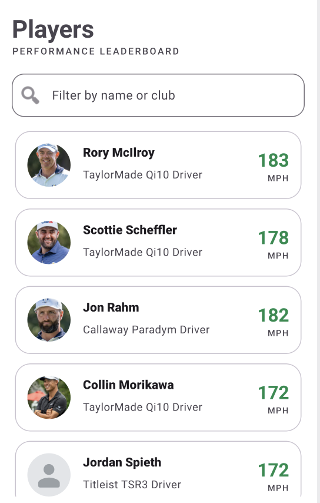
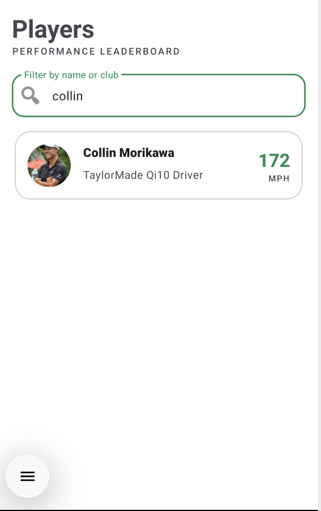
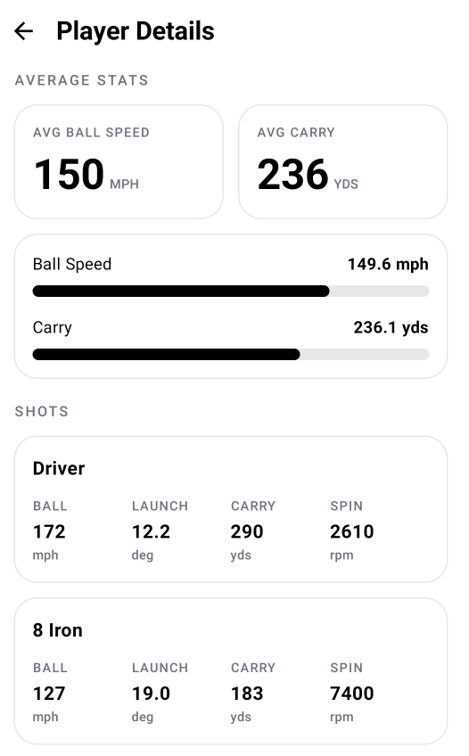

# Golf Performance App

An Android app to view golfers and their shot stats like ball speed, carry, launch angle and spin.

There are two screens:
- A list of players you can search by name or club.
- A detail screen with a player's average stats and each of their shots.

The data comes from JSON files hosted on GitHub. The app saves the data in a local database, so it still works without internet.

## App Screenshots

Players list:



Search by name or club:



Player details:



## Tech used

- Kotlin
- Coroutines and Flow
- Koin for dependency injection
- Retrofit + Moshi for the network
- Room for the local database
- Glide for images
- XML + data binding for the list, Jetpack Compose for the detail screen
- Timber for logs, Turbine for tests

## Project structure

The app is split into modules:

```
:app             app start-up, navigation, dependency injection setup
:feature-player  player list, player detail, and their ViewModels
:domain          models, repository interface, use cases (plain Kotlin)
:data            network, database, mappers, repository implementation
```

The modules depend in one direction. The UI and data layers depend on `domain`. The `domain` module has no Android or Retrofit code.

## How it works

- The app reads data from the local database, not directly from the network.
- A refresh calls the API and saves the result into the database.
- The screen listens to the database, so the UI updates on its own when data changes.
- If the network fails, the app keeps showing the saved data and shows an error message instead of crashing.
- When the internet comes back, the app refreshes again automatically.

Data flow:

```
Network (Retrofit)  ->  saved to Room  ->  domain models  ->  ViewModel  ->  UI
```

For more detail, see [docs/ARCHITECTURE.md](docs/ARCHITECTURE.md).

## How to build and run

You need:
- Android Studio
- JDK 17

The file `gradle.properties` sets the JDK path:

```
org.gradle.java.home=/Library/Java/JavaVirtualMachines/jdk-17.jdk/Contents/Home
```

If your JDK 17 is in a different place, change this line, or remove it and set the Gradle JDK in Android Studio under Settings → Build Tools → Gradle.

Then run it from Android Studio, or use the command line:

```bash
# build the debug app
./gradlew :app:assembleDebug

# install on a connected device or emulator
./gradlew :app:installDebug
```

## Testing

The tests use these libraries:

- JUnit — the test runner
- MockK — to mock dependencies
- Turbine — to test Flow values
- kotlinx-coroutines-test — to control coroutines in tests

Example: `PlayerDetailViewModelTest` in `feature-player` uses Turbine to check the stats the ViewModel sends to the UI.

## The data files

The "API" is two JSON files in the [`mock-api/`](mock-api/) folder:

- `Players.json` — id, name, club, average ball speed, image URL
- `shots.json` — shots for each player (ball speed, launch angle, carry, club type, spin)

The app reads these files from GitHub raw. The branch it reads from is chosen at build time:

- Building from the `develop` branch reads the `develop` data.
- Building from any other branch (including `main`) reads the `main` data.

This is handled in `data/build.gradle.kts` (it checks the current git branch) and `NetworkConfig.kt`. So both `main` and `develop` work, as long as the `mock-api/` files exist on both branches. If you change the JSON, push it to the matching branch before the app can see the change.

## Notes

- The app is read-only. There is no login or saving.
- The launcher icon and splash screen use custom images from free to use sources.

## Created by: Sneh Ayush